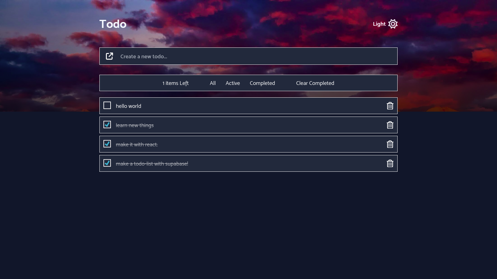

# Todo List With Supabase



[Live Site Demo](https://live-site-demo.com)

---

A simple and intuitive Todo List web application built with **React**, **Supabase**, and **Zustand** for state management.

## Features

- **Real-Time Synchronization**: Updates in real time across multiple devices.
- **Task Management**: Create, read, and delete tasks.
- **Light/Dark Mode**: Switch between light and dark themes for better user experience.

## Tech Stack

- **Frontend**: [React](https://reactjs.org/)
- **State Management**: [Zustand](https://github.com/pmndrs/zustand) state management solution.
- **Backend**: [Supabase](https://supabase.io/) (Database and API)
- **Real-Time Updates**: Supabase subscriptions.
- **Typescript**: [Typescript](https://typescript) - A strongly typed language, builds on top of javascript.
- **CSS Framework**: [Tailwind CSS](https://tailwindcss.com/) for styling.
- **Package Management**: [Pnpm](https://pnpm.io) for package management.
- **Bundler**: [Vite](https://vite.dev) is a blazing fast frontend build tool.

## Installation

1. Clone the repository:

   ```bash
   git clone https://github.com/souleymanesy7/todo-list-with-supabase.git
   cd todo-list-with-supabase
   ```

2. Install dependencies:

   ```bash
   pnpm install
   ```

3. Set up environment variables:

   Create a `.env` or `.env.local` file in the root directory and add the following environment variables:

   ```bash
   VITE_SUPABASE_URL=your_supabase_url
   VITE_SUPABASE_ANON_KEY=your_supabase_anon_key
   ```

4. Run the application:

   ```bash
   pnpm dev
   ```

The app will be available at <http://localhost:3000>.

## Contributing

Contributions are welcome! If you'd like to contribute, please fork the repository and use a feature branch. Pull requests are warmly welcome.

1. Fork the project.

2. Create your feature branch: `git checkout -b feature/my-feature`.

3. Commit your changes: `git commit -m 'Add some feature'`.

4. Push to the branch: `git push origin feature/my-feature`.

5. Open a pull request.

## Author

- GitHub - [Souleymane Sy](https://github.com/SouleymaneSy7)
- Frontend Mentor - [@SouleymaneSy7](https://www.frontendmentor.io/profile/SouleymaneSy7)
- Dev Challenges - [Souleymane Sy](https://devchallenges.io/profile/534cd213-3165-4c16-bdcf-058e1f468da0)
- Twitter - [@Souleymanesy43](https://twitter.com/Souleymanesy43)
